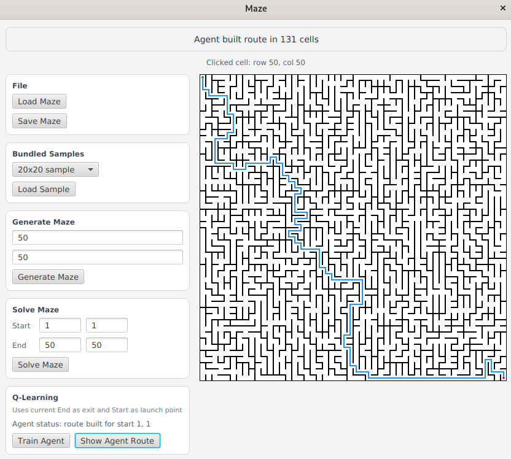

## Maze

Учебный проект на Kotlin с двумя визуальными режимами:

- генерация и решение лабиринтов;
- генерация и симуляция пещер;
- обучение агента прохождению лабиринта с помощью Q-learning;
- простой web-интерфейс для работы с лабиринтами.

Проект собран на `Kotlin 2.3`, `Java 21`, `JavaFX 21` и `Ktor`.

## Что умеет проект

### Лабиринты

- загрузка лабиринта из текстового файла;
- генерация нового лабиринта заданного размера;
- сохранение текущего лабиринта в файл;
- поиск кратчайшего пути между двумя клетками;
- выбор стартовой и конечной точки кликом по полю;
- обучение агента и построение маршрута через Q-learning.

### Пещеры

- загрузка пещеры из файла;
- случайная инициализация поля;
- пошаговая симуляция клеточного автомата;
- автоматический запуск эволюции с задержкой.

### Web-интерфейс

- загрузка лабиринта;
- генерация лабиринта;
- решение лабиринта через HTTP API и браузерный интерфейс.

## Скриншоты

### Окно лабиринта



### Генерация и эволюция пещеры

[Анимация генерации пещеры](main/resources/images/cave_generation.webm)

## Используемые алгоритмы

### Генерация лабиринта: алгоритм Эллера

Для генерации используется алгоритм Эллера. Он строит лабиринт построчно и поэтому хорошо подходит для прямоугольных полей.

Идея алгоритма простая:

- в каждой строке клетки объединяются в множества связности;
- между соседними клетками случайно убираются правые стены, если это не создает преждевременное объединение уже связанных клеток;
- вниз из каждого множества обязательно оставляется хотя бы один проход, чтобы связность не потерялась на следующей строке;
- последняя строка завершает объединение всех оставшихся множеств.

На практике это дает:

- связный лабиринт без изолированных областей;
- отсутствие циклов, то есть между двумя клетками существует единственный простой путь;
- хорошую скорость и компактную реализацию.

### Решение лабиринта: BFS

Для поиска пути используется `Breadth-First Search`.

Алгоритм проходит лабиринт слоями:

- стартовая клетка помещается в очередь;
- затем последовательно просматриваются все достижимые соседи;
- для каждой клетки сохраняется родитель, чтобы потом восстановить путь;
- как только найден финиш, маршрут восстанавливается в обратном порядке.

Поскольку все переходы между клетками имеют одинаковую стоимость, BFS находит кратчайший путь по числу шагов.

### Пещеры: клеточный автомат

Пещера представлена булевой матрицей:

- `1` означает заполненную клетку;
- `0` означает пустую клетку.

Начальное состояние создается случайно с заданной вероятностью заполнения. Дальше поле эволюционирует по правилам клеточного автомата:

- живая клетка остается живой, если число соседей не меньше `death limit`;
- мертвая клетка оживает, если число соседей больше `birth limit`.

Соседи считаются по восьми направлениям. Границы поля трактуются как заполненные, поэтому внешние области естественно стремятся к замыканию. Такой подход часто используют для генерации пещероподобных структур с крупными связными областями.

### Обучение агента: Q-learning

В проекте есть отдельный режим обучения агента для прохождения лабиринта.

Состояние агента - текущая клетка, действия - движения `up`, `down`, `left`, `right`. Во время обучения агент много раз пробует пройти лабиринт и обновляет таблицу `Q(s, a)`, где хранится ожидаемая полезность действия `a` в состоянии `s`.

Используется классическая идея:

- за достижение выхода выдается большая положительная награда;
- за обычный шаг дается небольшой штраф;
- за попытку пройти сквозь стену дается более сильный штраф;
- часть ходов выбирается случайно, чтобы агент исследовал пространство состояний.

После накопления опыта агент начинает предпочитать действия с максимальным `Q`-значением. В текущей реализации коэффициент исследования постепенно уменьшается по ходу эпизодов, поэтому в начале агент активнее исследует лабиринт, а ближе к концу чаще использует уже выученную стратегию.

Важно: Q-learning здесь не заменяет точный алгоритм поиска пути, а показывает, как задачу навигации можно решать через обучение с подкреплением.

## Форматы файлов

### Формат лабиринта

Файл содержит:

1. размеры `rows cols`;
2. матрицу правых стен размером `rows x cols`;
3. пустую строку;
4. матрицу нижних стен размером `rows x cols`.

`1` означает наличие стены, `0` - проход.

Пример:

```text
4 4
0 0 0 1
1 0 1 1
0 1 0 1
0 0 0 1

1 0 1 0
0 0 1 0
1 1 0 1
1 1 1 1
```

### Формат пещеры

Файл содержит:

1. размеры `rows cols`;
2. матрицу клеток размером `rows x cols`.

`1` означает заполненную клетку, `0` - пустую.

Пример:

```text
4 4
0 1 0 1
1 0 0 1
0 1 0 0
0 0 1 1
```

## Запуск

Требуется `JDK 21`.

### Desktop-приложение

```bash
./gradlew run
```

После запуска откроется окно выбора режима: `Maze` или `Cave`.

### Web-интерфейс

```bash
./gradlew runWeb
```

По умолчанию приложение поднимается на `http://localhost:8081`.

### Тесты

```bash
./gradlew test
```

## Структура проекта

- `main/kotlin/com/school21/model` - модели лабиринта, пещеры и агента;
- `main/kotlin/com/school21/service` - алгоритмы решения, симуляции и записи;
- `main/kotlin/com/school21/service/generator` - генераторы лабиринтов и пещер;
- `main/kotlin/com/school21/service/rl` - Q-learning и окружение агента;
- `main/kotlin/com/school21/view` - JavaFX-интерфейс;
- `main/kotlin/com/school21/web` - web-слой и API;
- `main/resources/mazes` и `main/resources/caves` - примеры файлов;
- `main/resources/images` - изображения и анимации для проекта.

## Коротко об идее проекта

Проект объединяет три близкие темы:

- классические алгоритмы генерации структур;
- алгоритмы поиска пути;
- обучение с подкреплением на простой и наглядной среде.

За счет этого его удобно использовать и как визуальный учебный инструмент, и как аккуратную демонстрацию нескольких разных подходов к работе с двумерными картами.
